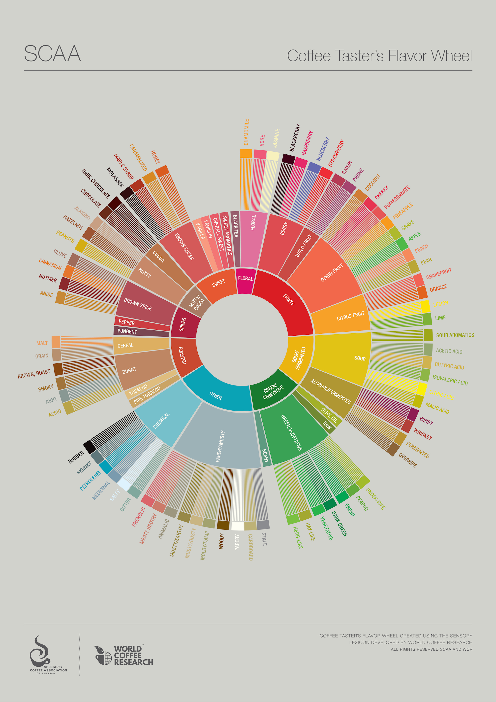

---

# :coffee:

---

# [fit] Covfefe

---

# [fit] Coffee

---

^ Could talk about where coffee comes from

---

^ How it is grown

---

# :poop:

^ Or what health effects it has

---

# [fit] Single
# [fit] Origin

^
Coffee beans sourced from the same geographical location
Can be sourced entirely from the same farmer
Can also mean same general region or even country

---

# [fit] House
# [fit] Blend

^
A blend of complimentary coffee beans
A combination of single origin beans
What you will get in most cafes

---

# Coffee Taster’s Flavor Wheel

^ SCAA
industry standard for over two decades
- professional sensory panelists
- scientists
- coffee buyers
- and roasting companies

---

^
- Comprehensive
- kaleidoscopic
- picture of coffee flavor.
- ‘Flavor’ is defined as a combination of taste and smell

---

^
wheel contains attributes
entire continuum between
basic tastes
(those things perceived only by the tongue)
to pure aromatics
(those things that only can be smelled).

---

^
working from the center
start with general taste descriptors
working outwards becomes more specific

___

^
Roasted
Nutty/Cocoa
Sweet
Fruity

---

# [fit] Cool
# [fit] Story

---

# [fit] I just wanna drink
# [fit] coffee

---

^
Historically Sydney coffee has had strong, dark characteristics
Specialty coffee shops show this in their house blends
Focused on chocolate and charamel flavours

---

^
Recently more cafes have been offering single origin coffee
Focusing on the individual characteristics
Brighter, less bitter
More acidic, floral, fruity

___

^
A few things to think about next time you get your next coffee

---
