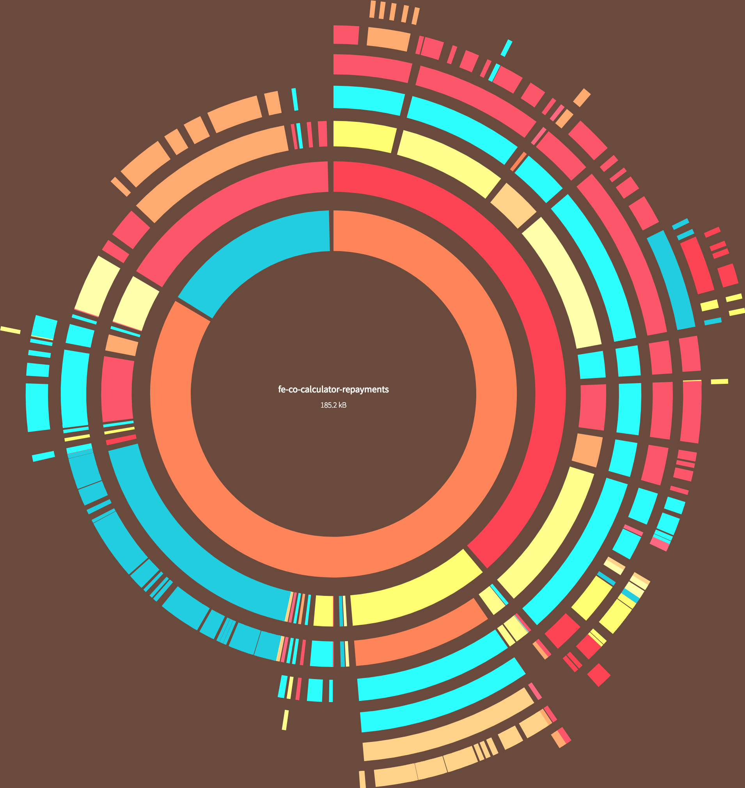
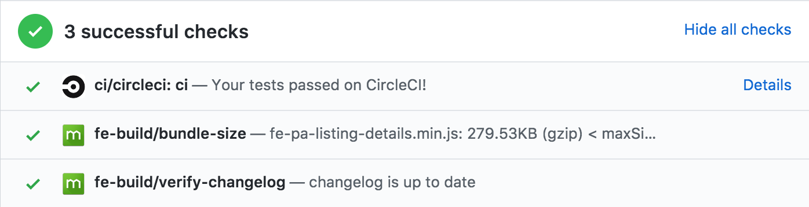

autoscale: true


# [fit] `fe-build`

## __All__ the things[^1]

[^1]: Hyperbole and a Half - [This is Why I'll Never be an Adult](http://hyperboleandahalf.blogspot.com.au/2010/06/this-is-why-ill-never-be-adult.html)

^ At Domain we use an in house tool called `fe-build`
We use it to develop all our react components
I'm going to walk through
- what it is
- why we use it
- and, how it works

---

Hi! 👋🏻

Jonathan Haines

[@BarryThePenguin](https://twitter.com/BarryThePenguin)

Twitter - GitHub

🐧

^ Hi! I'm Jonathan Haines
Everyone calls me Jonno
Software developer at Domain
Twitter and GitHub as Barry The Penguin

---

> I've heard from several people that they've consolidated their companies tool dependencies into a single package and this worked really well for them.
-- @dan_abramov 

---


# [fit] One Tool to rule them all

---

# [fit] but __why__?

^ But why would you want to have
a single tool that does everything?

---


# [fit] Opinions — Opinions everywhere

^ Opinions, everyone has opinions

---

# opinions

- enforce consistency
- while encouraging communication
- cure javascript fatigue 🤕

^ allows us to enforce consistency across teams
while also encouraging communication between teams

^ also helps make a lot of decisions
especially when starting a new project
or building a new react component

---

# measure twice, cut once

- developer experience
- centralise bug fixes and new features
- skill transfer between teams

^ allows us to focus on developer experience
- adding new features
- deprecating and removing old features
- error handling
- fixing all those little issues nobody wants to touch
frees teams up to ship features
not get stuck building and fixing tools

---

```json
{
  "scripts": {
    "start": "npm run watch",
    "start:prod": "yarn run generate:slugmap && node -r dotenv-safe/config lib/index.js",
    "start:https": "nginx -c $(./nginx/inject-env < nginx/local.conf) & yarn start",
    "version": "version-changelog CHANGELOG.md && changelog-verify CHANGELOG.md && git add CHANGELOG.md",
    "watch": "cross-env NODE_ENV=development nodemon --ignore src/views/client/ -w .env -w src -x node --inspect -r dotenv-safe/config -r babel-core/register src/index.js",
    "debug:webstorm": "cross-env NODE_ENV=development nodemon $NODE_DEBUG_OPTION --ignore src/views/client/ -w .env -w src -x node -r dotenv-safe/config -r babel-core/register src/index.js",
    "watch:search-results": "cd src/views/client/search-results && fe-build watch",
    "watch:error-page": "cd src/views/client/error-page && fe-build watch",
    "watch:docker": "yarn run watch -- -L",
    "docker:start": "docker-compose up",
    "docker:stop": "docker-compose down",
    "docker:build": "yarn run start:docker -- --build",
    "test:watch": "nodemon -w src -w test -x 'yarn test'",
    "tdd": "mocha --watch --recursive test/unit",
    "test": "npm-run-all --print-label --parallel test:unit test:integration flow lint",
    "test:unit": "nyc mocha --recursive test/unit",
    "pretest:integration": "yarn run bundle",
    "test:integration": "mocha --timeout 5000 --recursive test/integration*",
    "test:e2e": "fe-e2e-tests -c test/e2e/nightwatch.conf.js -h /phoenix/api/ping -e mobile,tablet,chrome",
    "test:e2e-browserstack": "fe-e2e-tests -c test/e2e/nightwatch.conf.js -h /phoenix/api/ping -e chrome,firefox,ie,mobile,tablet --browserstack",
    "test:e2e-browserstack-prod": "fe-e2e-tests -c test/e2e/nightwatch.conf.js -h /phoenix/api/ping -e chrome,mobile --browserstack",
    "test:e2e-concurrently": "test/e2e/concurrent-run.sh",
    "test:e2e-concurrently-prod": "E2E_PROD_TEST=true test/e2e/concurrent-run.sh",
    "test:perf:report": "fe-perf-tests --shape=test/perf/report-shape.json --json=auto --local=/sale/pyrmont-nsw-2009/",
    "test:perf:pretty": "fe-perf-tests --shape=test/perf/report-shape.json --json --local=/sale/pyrmont-nsw-2009/",
    "test:perf:others": "fe-perf-tests --shape=test/perf/report-shape.json --json=auto --url=https://www.domain.com.au/sale/pyrmont-nsw-2009/",
    "lint": "eslint src test",
    "lint:fix": "eslint src test --fix",
    "build": "babel --quiet --out-dir lib --ignore=src/views/client src --copy-files && babel --quiet --out-dir lib/views/client/search-results/src/js/shared src/views/client/search-results/src/js/shared --copy-files && npm run bundle",
    "build:clean": "rm -rf assets/components/ src/views/client/*/lib/ lib/ coverage/ .nyc-output",
    "bundle": "cross-env LOG_LEVEL=error node scripts/bundle.js",
    "bundle:report": "cd src/views/client/search-results && fe-build dist:bundle --with-report",
    "flow": "flow check",
    "flow:stop": "flow stop",
    "flow:coverage": "flow coverage src/*.js --color",
    "flow-typed:update": "flow-typed update",
    "flow-typed:install": "flow-typed install",
    "update:source:slugmap": "cross-env SLUGMAP_URL=https://s3-ap-southeast-2.amazonaws.com/domain-location-data/production/slugmap.json yarn run generate:slugmap",
    "generate:slugmap": "node -r dotenv-safe/config generateSlugMap.js",
    "url-tester": "babel-node ./scripts/url-tester.js",
    "slug-tester": "babel-node ./scripts/slug-tester.js",
    "prune:run": "node ./scripts/yarn-prune.js",
    "local-fe-pa": "renderizr-devserver --out=./assets/components --static-route=\"http://localhost:3000/phoenix/assets/components\" --path=../fe-pa-listing-details --theme=domain --fallback=false"
  }
}
```

^ assuming everyone has seen
npm scripts that look like this
not inherently bad
but not easy to understand
there is a lot going on

---

# 🙀

---

   

   

   

    

^ these are a bunch of tools that
are integrated into fe-build
you may recognise a few of them

^ you don't need to know them all
documentation detailing
what tools you need to know
and when you need to use them

___

```json
{
  "scripts": {
    "watch": "fe-build watch",
    "build": "fe-build build",
    "lint": "fe-build lint",
    "test": "fe-build test",
    "tdd": "fe-build tdd"
  }
}
```
---

# [fit] build, lint, test, publish, report

^ all the commands available in fe-build
I'll step through each one

---

# [fit] build

---

# `fe-build watch`

`js – css – assets`

- demo environment
- simulate the real world
- reflect changes quickly

---

# `fe-build build`

- bundle and babel javascript
- copy scss and static assets
- into `/lib` ready to publish

--- 

# `fe-build/babel`

- `babel-preset-react`
- `babel-preset-env`
- `react-hot-loader/babel`
- `babel-plugin-transform-flow-strip-types`

^ exposes a babel config

---

# `fe-co-demo`

^ our equivalent of react-storybook
Show fe-build and fe-co-demo

---

# [fit] lint

---

# `fe-build lint`

`js – css – markdown`

__why lint?__

- consistency
- reduce developer error
- enforce opinions

^ we lint js, css and markdown
why lint?
I asked everyone this morning

---

__opinions?__

- developer consensus
- let someone else make the decision
- `fe-build@beta` introducing `prettier`

^ opinions mean getting consensus
easier to let someone else make the decision
we use the airbnb eslint config
we're also introducing prettier
want to make less decisions about linting

---

```js
module.exports = {
  plugins: [
    'react',
  ],

  parserOptions: {
    ecmaFeatures: {
      jsx: true,
    },
  },

  rules: {
    'jsx-quotes': ['error', 'prefer-double'],

    'class-methods-use-this': ['error', {
      exceptMethods: [
        'render',
        'getInitialState',
        'getDefaultProps',
        'getChildContext',
        'componentWillMount',
        'componentDidMount',
        'componentWillReceiveProps',
        'shouldComponentUpdate',
        'componentWillUpdate',
        'componentDidUpdate',
        'componentWillUnmount',
      ],
    }],

    'react/display-name': ['off', { ignoreTranspilerName: false }],
    'react/forbid-prop-types': ['error', { forbid: ['any', 'array', 'object'] }],
    'react/jsx-boolean-value': ['error', 'never', { always: [] }],
    'react/jsx-closing-bracket-location': ['error', 'line-aligned'],
    'react/jsx-closing-tag-location': 'error',
    'react/jsx-curly-spacing': ['error', 'never', { allowMultiline: true }],
    'react/jsx-handler-names': ['off', {
      eventHandlerPrefix: 'handle',
      eventHandlerPropPrefix: 'on',
    }],
    'react/jsx-indent-props': ['error', 2],
    'react/jsx-key': 'off',
    'react/jsx-max-props-per-line': ['error', { maximum: 1, when: 'multiline' }],
    'react/jsx-no-bind': ['error', {
      ignoreRefs: true,
      allowArrowFunctions: true,
      allowBind: false,
    }],
    'react/jsx-no-duplicate-props': ['error', { ignoreCase: true }],
    'react/jsx-no-literals': ['off', { noStrings: true }],
    'react/jsx-no-undef': 'error',
    'react/jsx-pascal-case': ['error', {
      allowAllCaps: true,
      ignore: [],
    }],
    'react/sort-prop-types': ['off', {
      ignoreCase: true,
      callbacksLast: false,
      requiredFirst: false,
    }],
    'react/jsx-sort-prop-types': 'off',
    'react/jsx-sort-props': ['off', {
      ignoreCase: true,
      callbacksLast: false,
      shorthandFirst: false,
      shorthandLast: false,
      noSortAlphabetically: false,
      reservedFirst: true,
    }],
    'react/jsx-uses-react': ['error'],
    'react/jsx-uses-vars': 'error',
    'react/no-danger': 'warn',
    'react/no-deprecated': ['error'],
    'react/no-did-mount-set-state': 'off',
    'react/no-did-update-set-state': 'error',
    'react/no-will-update-set-state': 'error',
    'react/no-direct-mutation-state': 'off',
    'react/no-is-mounted': 'error',
    'react/no-multi-comp': ['error', { ignoreStateless: true }],
    'react/no-set-state': 'off',
    'react/no-string-refs': 'error',
    'react/no-unknown-property': 'error',
    'react/prefer-es6-class': ['error', 'always'],
    'react/prefer-stateless-function': ['error', { ignorePureComponents: true }],
    'react/prop-types': ['error', {
      ignore: [],
      customValidators: [],
      skipUndeclared: false
    }],
    'react/react-in-jsx-scope': 'error',
    'react/require-render-return': 'error',
    'react/self-closing-comp': 'error',
    'react/sort-comp': ['error', {
      order: [
        'static-methods',
        'lifecycle',
        '/^on.+$/',
        'getters',
        'setters',
        '/^(get|set)(?!(InitialState$|DefaultProps$|ChildContext$)).+$/',
        'everything-else',
        '/^render.+$/',
        'render'
      ],
    }],
    'react/jsx-wrap-multilines': ['error', {
      declaration: true,
      assignment: true,
      return: true,
      arrow: true,
    }],
    'react/jsx-first-prop-new-line': ['error', 'multiline-multiprop'],
    'react/jsx-equals-spacing': ['error', 'never'],
    'react/jsx-indent': ['error', 2],
    'react/jsx-no-target-blank': 'error',
    'react/jsx-filename-extension': ['error', { extensions: ['.jsx'] }],
    'react/jsx-no-comment-textnodes': 'error',
    'react/no-render-return-value': 'error',
    'react/require-optimization': ['off', { allowDecorators: [] }],
    'react/no-find-dom-node': 'error',
    'react/forbid-component-props': ['off', { forbid: [] }],
    'react/forbid-elements': ['off', { forbid: [], }],
    'react/no-danger-with-children': 'error',
    'react/no-unused-prop-types': ['error', {
      customValidators: [
      ],
      skipShapeProps: true,
    }],
    'react/style-prop-object': 'error',
    'react/no-unescaped-entities': 'error',
    'react/no-children-prop': 'error',
    'react/jsx-tag-spacing': ['error', {
      closingSlash: 'never',
      beforeSelfClosing: 'always',
      afterOpening: 'never'
    }],
    'react/jsx-space-before-closing': ['off', 'always'],
    'react/no-array-index-key': 'error',
    'react/require-default-props': 'error',
    'react/forbid-foreign-prop-types': 'off',
    'react/void-dom-elements-no-children': 'error',
    'react/default-props-match-prop-types': ['error', { allowRequiredDefaults: false }],
    'react/no-redundant-should-component-update': 'error',
    'react/no-unused-state': 'error',
    'react/boolean-prop-naming': ['off', {
      propTypeNames: ['bool', 'mutuallyExclusiveTrueProps'],
      rule: '^(is|has)[A-Z]([A-Za-z0-9]?)+',
    }],
    'react/no-typos': 'error',
    'react/jsx-curly-brace-presence': ['error', { props: 'never', children: 'never' }]
  },

  settings: {
    'import/resolver': {
      node: {
        extensions: ['.js', '.jsx', '.json']
      }
    },
    react: {
      pragma: 'React',
      version: '15.0'
    },
    propWrapperFunctions: [
      'forbidExtraProps', // https://www.npmjs.com/package/airbnb-prop-types
      'exact', // https://www.npmjs.com/package/prop-types-exact
      'Object.freeze', // https://tc39.github.io/ecma262/#sec-object.freeze
    ],
  }
};
```
---

```js
  'react/no-array-index-key': 'error',
  'react/require-default-props': 'error',
  'react/forbid-foreign-prop-types': 'off',
  'react/void-dom-elements-no-children': 'error',
  'react/default-props-match-prop-types': ['error', { allowRequiredDefaults: false }],
  'react/no-redundant-should-component-update': 'error',
  'react/no-unused-state': 'error',
  'react/boolean-prop-naming': ['off', {
    propTypeNames: ['bool', 'mutuallyExclusiveTrueProps'],
    rule: '^(is|has)[A-Z]([A-Za-z0-9]?)+',
  }],
  'react/no-typos': 'error',
  'react/jsx-curly-brace-presence': ['error', { props: 'never', children: 'never' }]
```

---

# `package.json`

```json
{
  "eslintConfig": {
    "extends": "@domain-group/eslint-config-domain/browser"
  }
}
```

---

# `eslint-config-domain`

- `airbnb`
- `prettier`
- `flowtype`
- `import`
- `jsx-a11y`
- `react`

---

# `remark-preset-domain`

- lint documentation
- generate table of contents
- validate links

---

# [fit] test

---

# `fe-build test`

`flow - lint - test`

- single command for ci
- lint everything
- run tests
- report code coverage

---

# test setup

## DOM and pollyfills

```js
require('babel-register');
const { JSDOM } = require('jsdom');

const { window } = new JSDOM(
  '<!doctype html><html><body><script></script></body></html>'
);

global.window = window;
global.document = window.document;

// pollyfills
require('match-media');
require('match-media/matchMedia.addListener');
require('babel-polyfill');
```

^ test setup for mocha

---

# test setup

## globals and assertions

```js
global.React = require('react');
global.sinon = require('sinon');
global.enzyme = require('enzyme');
global.chai = require('chai');

const Adapter = require('enzyme-adapter-react-15');
global.enzyme.configure({ adapter: new Adapter() });

global.expect = global.chai.expect;

global.chai.use(require('chai-enzyme'));
global.chai.use(require('chai-as-promised'));
global.chai.use(require('chai-datetime'));
global.chai.use(require('sinon-chai'));
global.chai.use(require('dirty-chai'));
```

^ other half of our test setup for mocha

---

# `fe-build tdd`

- test setup
- instant feedback
- useful for tdd

---

# `fe-build coverage`

- code coverage
- uses `nyc` and babel config

---

# [fit] publish

---

# `np` [^2]

- interactivly specify new semver version
- ensures you are on `master` and up to date
- ensures dependencies match `package.json`
- runs `npm test`, `npm version`, `npm publish`

[^2]: Sindre Sorhus - https://github.com/sindresorhus/np

---

# `CHANGELOG.md`

- each project keeps a changelog [^3]
- notable changes for each version released
- written by a human

[^3]: http://keepachangelog.com/

---

# `fe-build changelog`

- version the changelog
- verify a changelog entry exists
- add link to compare changes on GitHub
- add release date

---

# [fit] report

---

# [fit] `fe-build report:bundle`

Analyse `browserify` bundles with `disc` [^4]



[^4]: Hugh Kennedy - https://github.com/hughsk/disc

---

# `fe-build report:bundle:size`

- report bundle sizes in pull requests
- warning for large bundle sizes

Inspiration taken from `siddharthkp/bundlesize` [^5]

[^5]: Siddharth Kshetrapal - https://github.com/siddharthkp/bundlesize

---



---

# `fe-build report:dependencies`

Analyse dependencies of a project with `depcheck` [^6]

```bash
$ "fe-build" "report:dependencies"
13:30:51 ✨  fe-build 12.7.0
13:30:51 ✨  fe-build Starting 'report:dependencies'...
13:30:54 ⚠️  fe-build 6 unused dependencies found in package.json taking up around 6.81 MB. You should uninstall these:
13:30:54 ⚠️  fe-build - @domain-group/fe-co-button (584 KB)
13:30:54 ⚠️  fe-build - @domain-group/fe-co-form-group-wrapper (492 KB)
13:30:54 ⚠️  fe-build - @domain-group/fe-co-loader (444 KB)
13:30:54 ⚠️  fe-build - @domain-group/fe-co-myd-animations (408 KB)
13:30:54 ⚠️  fe-build - classnames (44 KB)
13:30:54 ⚠️  fe-build - lodash (4.89 MB)
```

[^6]: - https://github.com/depcheck/depcheck

---

# [fit] the sharp edges 🔪

---

- dependency management
- breaking changes
- consensus

^ The current beta version has a lot of breaking changes
All changes are documented
Will take time for teams to update their components

^ Adding new features can take time
Either need to consider a lot of moving parts 
Or discussion between teams take a long time to resolve

---

# [fit] what __next__?

---

- mock api server
- error reporting
- css-in-js
- webpack

___

# 🐶

